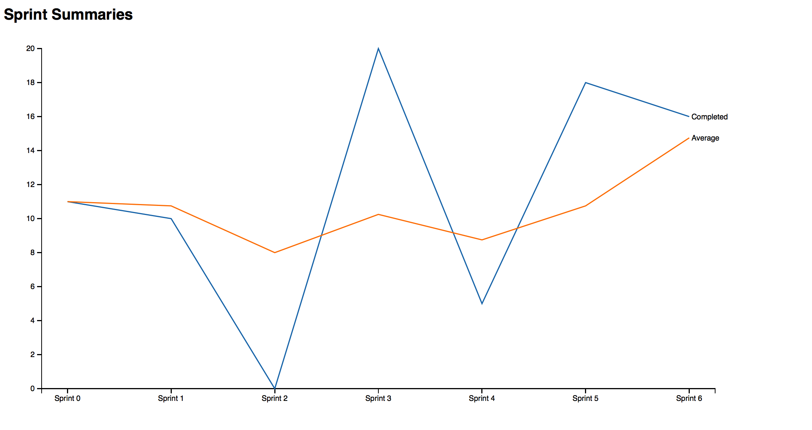

jira-burndown-charts
====================

Create charts from your Jira/Greenhopper instance!

Currently, this tool creates charts from greenhopper if you are using sprints and story points.
It will create a chart with 2 series, the number of points completed every sprint, and the 4 week moving average for each sprint, ending that sprint.

Configuration 
=============
You will need to configure the API endpoints in the application.conf file

Using
=====
Currently, this is a standalone app that requies you to use sbt to compile and run. 

From there, serve index.html and burndown.json from your favourite server.

Preview
=======

